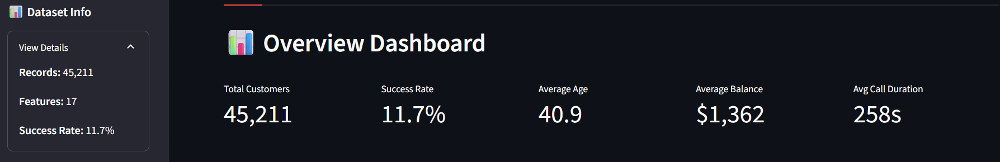
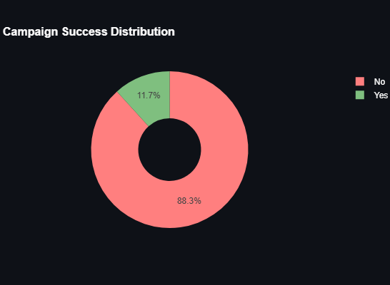
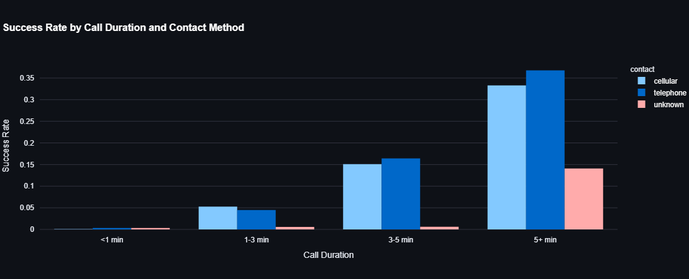
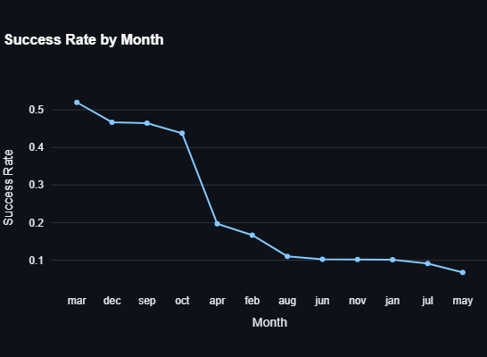
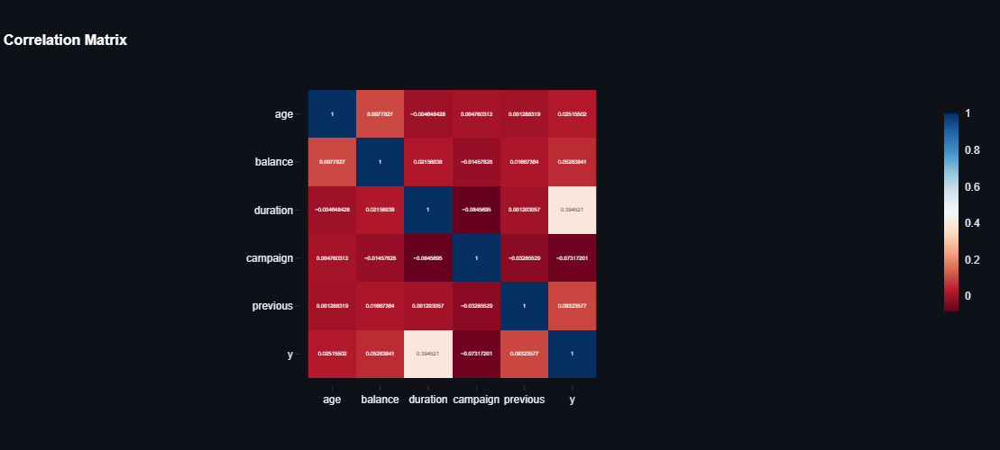

# Banking Data EDA Dashboard

A comprehensive **Banking Data EDA Dashboard** built with [Streamlit](https://streamlit.io/), [Pandas](https://pandas.pydata.org/), [NumPy](https://numpy.org/), [Plotly](https://plotly.com/), and [SciPy](https://scipy.org/). This interactive web application enables users to analyze banking campaign data through dynamic visualizations, key performance indicators (KPIs), and advanced statistical insights. Users can upload a CSV file or use the default dataset to explore demographics, financial metrics, campaign performance, temporal trends, and advanced analytics with customizable filters.

## Table of Contents
- [Overview](#overview)
- [Features](#features)
- [Screenshots](#screenshots)
- [Installation](#installation)
- [Usage](#usage)
- [Dataset](#dataset)
- [Deployment](#deployment)
- [Contact](#contact)

## Overview
The Banking Data EDA Dashboard is designed for data analysts, marketing teams, and banking professionals to explore and gain insights from banking campaign data. Users can upload a CSV file (e.g., `bank-full.csv`) and apply interactive filters to analyze customer demographics, financial behaviors, campaign outcomes, and temporal patterns. The dashboard provides real-time KPIs, detailed visualizations, statistical tests, and data export options for further analysis.

## Features
- **Interactive Visualizations**: Includes pie charts, histograms, bar charts, box plots, heatmaps, scatter plots, and parallel coordinates powered by Plotly.
- **Dynamic Filters**: Filter data by age range, job category, education level, marital status, balance range, and call duration using sidebar controls.
- **Key Performance Indicators (KPIs)**: Displays total customers, success rate, average age, average balance, and average call duration with delta comparisons.
- **Comprehensive Dashboards**:
  - **Overview**: KPIs, campaign success distribution, and age distribution.
  - **Demographics**: Job, education, marital status, and age group analysis with heatmaps.
  - **Financial**: Balance distribution, loan analysis, and financial segment insights.
  - **Campaign**: Contact method, call duration, and previous outcome analysis.
  - **Temporal**: Monthly and daily campaign performance trends.
  - **Advanced**: Correlation analysis, statistical tests, parallel coordinates, and predictive insights.
- **Data Export**: Download filtered data as CSV (planned feature for future implementation).
- **Responsive Design**: Optimized for desktop and mobile with a wide layout and custom CSS styling.
- **Data Quality Checks**: Validates dataset structure and handles missing values.

## Screenshots
Below are placeholders for screenshots of the Banking Data EDA Dashboard (to be added as you capture them):

### KPIs and Filters

*Displays key performance indicators and sidebar filters.*

### Success Rate

*Shows job distribution of success rate.*

### Campaign Performance

*Displays contact method and call duration.*

### Temporal Trends

*Shows campaign volume and success rates by month.*

### Advanced Analytics

*Includes correlation heatmap and parallel coordinates plot.*

## Installation
To run the dashboard locally, follow these steps:

1. **Clone the Repository**:
   ```bash
   git clone https://github.com/AvazAsgarov/streamlit-banking-dashboard.git
   cd streamlit-banking-dashboard
   ```

2. **Install Dependencies**:
   Ensure you have Python 3.8+ installed, then install the required packages:
   ```bash
   pip install -r requirements.txt
   ```

3. **Run the Application**:
   Launch the Streamlit app:
   ```bash
   streamlit run banking_streamlit_app.py
   ```
   The dashboard will open in your default web browser.

## Usage
1. **Access the Live App**: Visit [Banking Data EDA Dashboard](https://banking-dashboard-avaz-asgarov.streamlit.app/) to explore the dashboard online.
2. **Upload Data**: Use the file uploader to load your `bank-full.csv` file, or rely on the default dataset path if configured.
3. **Adjust Filters**: Use the sidebar to set filters for age, job, education, marital status, balance, and call duration.
4. **Explore Tabs**:
   - **Overview**: View KPIs, campaign success distribution, and summary statistics.
   - **Demographics**: Analyze job, education, marital status, and age group trends.
   - **Financial**: Explore balance distributions and loan impacts.
   - **Campaign**: Assess contact methods, call durations, and previous outcomes.
   - **Temporal**: Investigate monthly and daily campaign trends.
   - **Advanced**: Dive into correlations, statistical tests, and predictive insights.
5. **Export Data**: (Future feature) Download filtered datasets or summary statistics as CSV files.

## Dataset
The dashboard supports a CSV file (e.g., `bank-full.csv`) with the following required columns:
- **age**: Customer age (numeric)
- **job**: Job category (categorical)
- **education**: Education level (categorical)
- **marital**: Marital status (categorical)
- **balance**: Account balance (numeric)
- **duration**: Call duration in seconds (numeric)
- **campaign**: Number of contacts in current campaign (numeric)
- **previous**: Number of previous contacts (numeric)
- **y**: Campaign outcome (binary: 'yes'/'no' or 1/0)
- **contact**: Contact method (categorical)
- **poutcome**: Previous campaign outcome (categorical)
- **month**: Month of contact (categorical)
- **day**: Day of the month (numeric)

The dataset should be in CSV format with a semicolon (`;`) delimiter and must include these columns for full functionality.

## Deployment
This dashboard is deployed using [Streamlit Community Cloud](https://streamlit.io/cloud). Access the live app at [Banking Data EDA Dashboard](https://banking-dashboard-avaz-asgarov.streamlit.app/). The deployment is managed from the GitHub repository `streamlit-banking-dashboard`, requiring only the Python script (`banking_eda_dashboard.py`) and `requirements.txt`.

## Contact
For any questions or suggestions, please open an issue in the [GitHub repository](https://github.com/AvazAsgarov/streamlit-banking-dashboard) or connect with me on LinkedIn: **[Avaz Asgarov](https://www.linkedin.com/in/avaz-asgarov/)**.
